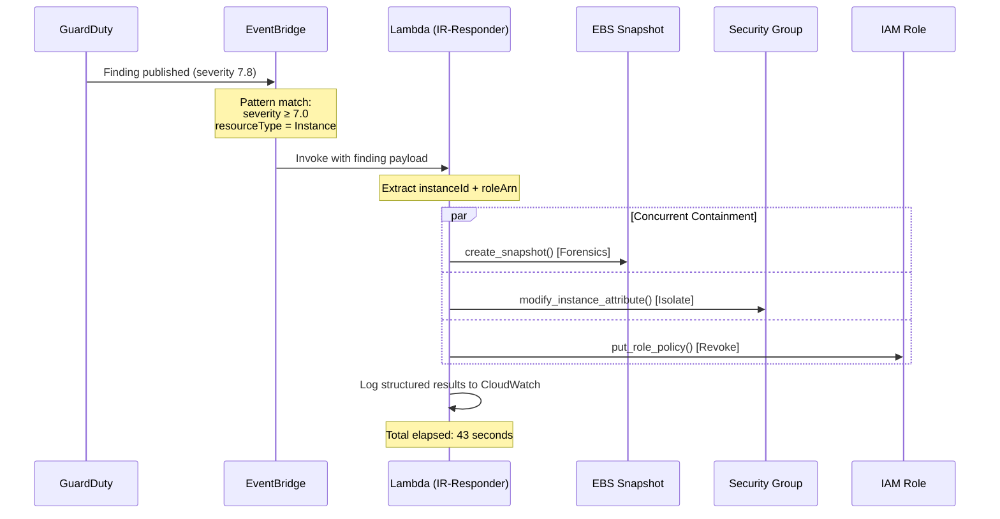
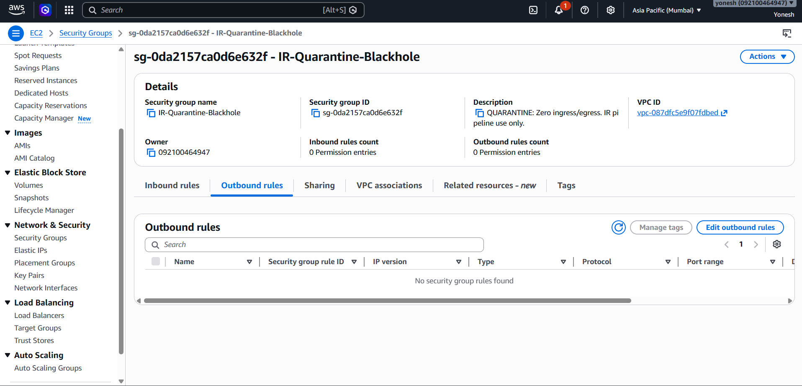
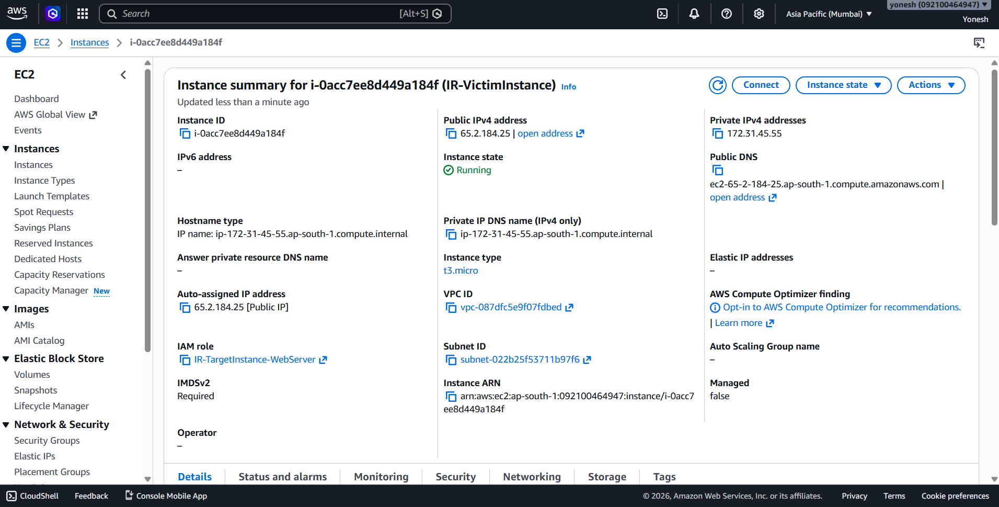
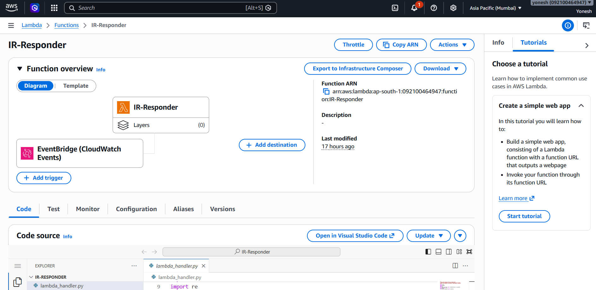
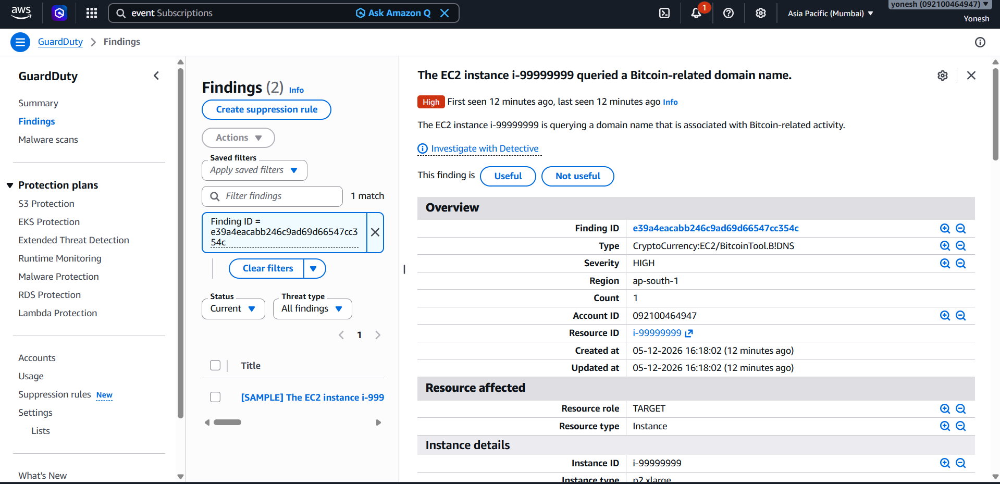
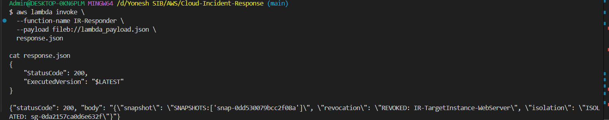
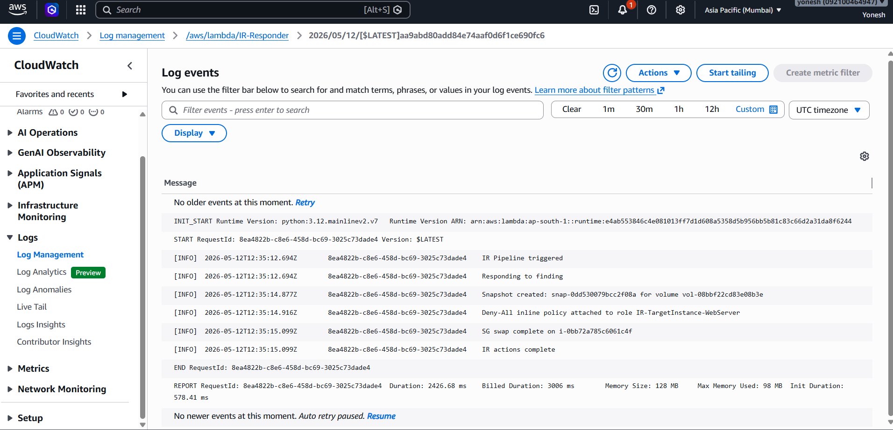

<div align="center">

# 🛡️ Serverless Cloud Incident Response Pipeline

**Automated EC2 threat containment in under 60 seconds — no human in the loop.**

[](https://python.org)
[](https://aws.amazon.com/lambda/)
[](https://aws.amazon.com/guardduty/)
[](https://aws.amazon.com/eventbridge/)
[](LICENSE)
[](iam/)

<br/>

> **Reduced EC2 incident containment MTTR from ~45 minutes (manual) to 43 seconds (automated).**  
> Detection → Isolation → Forensics → Credential Revocation — all without a human touching the console.

<br/>

| Metric | Value |
|:---|:---:|
| ⚡ Measured MTTR | **43 seconds** |
| 🔒 Containment Vectors | **3 simultaneous** |
| 🛑 IAM Resource Wildcards | **0** |
| 🧪 Idempotency Checks | **3 / 3 actions** |
| 📦 AWS Services Used | **5** |

</div>

---

## 📌 Table of Contents

- [Problem Statement](#-problem-statement)
- [Architecture](#-architecture)
- [How It Works](#-how-it-works)
- [Tech Stack](#-tech-stack)
- [Repository Structure](#-repository-structure)
- [Setup & Deployment](#-setup--deployment)
- [Simulating a Finding](#-simulating-a-finding)
- [IAM Design — Least Privilege](#-iam-design--least-privilege)
- [Security Considerations](#-security-considerations)
- [Measured Results](#-measured-results)
- [Future Enhancements](#-future-enhancements)

---

## 🎯 Problem Statement

When an EC2 instance is compromised — SSH brute force, crypto-mining, C2 callback — the attacker's clock starts immediately. Research shows that lateral movement typically begins **within 15–30 minutes** of initial compromise.

The traditional response workflow looks like this:

```
GuardDuty Alert
      ↓
Analyst gets paged            (~5–10 min)
      ↓
Analyst triages the finding   (~10–15 min)
      ↓
Analyst logs into console     (~5 min)
      ↓
Manual isolation steps        (~10–15 min)
      ↓
Total MTTR: 30–45 minutes
```

**That window is too large.** By the time a human responds, the attacker may have already pivoted to S3, IAM, or adjacent services.

This project automates the entire containment sequence and brings MTTR to **under 60 seconds**, well before lateral movement is possible.

---

## 🏗️ Architecture

```
┌─────────────────────────────────────────────────────────────────────┐
│                        AWS Environment                              │
│                                                                     │
│   EC2 Instance                                                      │
│   (Compromised)                                                     │
│       │                                                             │
│       │  VPC Flow Logs / CloudTrail / DNS Logs                      │
│       ▼                                                             │
│  ┌──────────────┐   Finding (severity ≥ 7.0)   ┌───────────────┐   │
│  │  GuardDuty   │ ────────────────────────────► │ EventBridge   │   │
│  │  (Detector)  │                               │ Rule + Filter │   │
│  └──────────────┘                               └───────┬───────┘   │
│                                                         │           │
│                                                         │ Invoke    │
│                                                         ▼           │
│                                                ┌────────────────┐   │
│                                                │ Lambda         │   │
│                                                │ IR-Responder   │   │
│                                                │ (Python 3.12)  │   │
│                                                └───────┬────────┘   │
│                                                        │            │
│                         ┌──────────────────────────────┤            │
│                         │              │               │            │
│                  (concurrent)   (concurrent)    (concurrent)        │
│                         │              │               │            │
│                         ▼              ▼               ▼            │
│               ┌──────────────┐ ┌────────────┐ ┌─────────────────┐  │
│               │ EBS Snapshot │ │  SG Swap   │ │ IAM Inline      │  │
│               │ (Forensics)  │ │ (Isolate)  │ │ Deny-All Policy │  │
│               └──────────────┘ └────────────┘ └─────────────────┘  │
│                                                                     │
│               ┌──────────────────────────────────────────────────┐ │
│               │           Amazon CloudWatch Logs                  │ │
│               │        (Structured JSON audit trail)              │ │
│               └──────────────────────────────────────────────────┘ │
└─────────────────────────────────────────────────────────────────────┘
```

### Event Flow Diagram



---

## ⚙️ How It Works

The pipeline executes three simultaneous containment actions the moment a high-severity GuardDuty finding is detected:

### Action 1 — Forensic EBS Snapshot

Before any modification, the Lambda creates an immutable point-in-time snapshot of all EBS volumes attached to the compromised instance. Tagged with the GuardDuty `FindingId` for chain-of-custody traceability.

> **Why first?** NIST SP 800-61 requires evidence preservation **before** system modification. Snapshotting post-isolation could reflect altered state and invalidate the evidence.

### Action 2 — Network Isolation (SG Swap)

Replaces all Security Groups on the instance with a **zero-ingress, zero-egress quarantine SG**. The instance retains its IP assignment and metadata but cannot send or receive any network traffic.

> **Effect:** The attacker loses network access within milliseconds of Lambda execution.

### Action 3 — IAM Credential Revocation

Attaches an **inline Deny-All IAM policy** to the EC2 instance's attached role. All active STS tokens issued to that role are immediately invalidated — even if they haven't expired yet.

> **Why inline?** Inline policies are evaluated on every API call and take effect instantly. They're also scoped 1:1 to the role and auto-deleted when the role is removed — no orphaned policies.

---

## 🧰 Tech Stack

| Layer | Technology | Purpose |
|:---|:---|:---|
| Detection | Amazon GuardDuty | ML-based threat detection from Flow Logs, CloudTrail, DNS |
| Routing | Amazon EventBridge | Content-based event filtering and Lambda invocation |
| Compute | AWS Lambda (Python 3.12) | Stateless serverless execution of containment actions |
| Forensics | Amazon EBS Snapshots | Immutable forensic disk image before containment |
| Isolation | EC2 Security Groups | Zero-ingress/egress quarantine network boundary |
| Revocation | AWS IAM Inline Policy | Immediate STS credential invalidation |
| Observability | Amazon CloudWatch Logs | Structured JSON audit trail of all IR actions |
| IaC (future) | AWS SAM / Terraform | Repeatable, version-controlled deployment |

---

## 📁 Repository Structure

```
Cloud-Incident-Response/
│
├── src/
│   └── lambda_handler.py        # Core Lambda function
│
├── iam/
│   ├── ec2-trust.json      # Who can assume the execution role
│   ├── lambda_trust_policy.json      # Who can assume the execution role
│   ├── lambda_execution_policy.json    # Least-privilege permissions (tag-scoped)
│   └── eventbridge_pattern.json      # GuardDuty finding filter pattern
│
├── docs/
│   └── architecture.md          # Detailed architecture notes
│
├── tests/
│   └── test_lambda_handler.py   # Unit tests using moto (AWS mock library)
│
├── lambda_payload.json
└── README.md
```

---

## 🚀 Setup & Deployment

### Prerequisites

- AWS CLI configured (`aws configure`)
- Python 3.12
- An AWS account with permissions to create IAM roles, Lambda, GuardDuty, EventBridge

### Phase 1 — IAM & Security Group

```bash
# 1. Create Lambda execution role
aws iam create-role \
  --role-name IR-Lambda-ExecutionRole \
  --assume-role-policy-document file://iam/lambda_trust_policy.json \
  --tags Key=Project,Value=cloud-ir-pipeline

# 2. Attach least-privilege policy
aws iam put-role-policy \
  --role-name IR-Lambda-ExecutionRole \
  --policy-name IR-Lambda-ExecutionPolicy \
  --policy-document file://iam/lambda_execution_role.json

# 3. Create quarantine Security Group (zero inbound + zero outbound)
export VPC_ID=$(aws ec2 describe-vpcs \
  --filters Name=isDefault,Values=true \
  --query Vpcs[0].VpcId --output text)

aws ec2 create-security-group \
  --group-name IR-Quarantine-Blackhole \
  --description "QUARANTINE: Zero ingress/egress. IR pipeline use only." \
  --vpc-id $VPC_ID \
  --tag-specifications "ResourceType=security-group,Tags=[{Key=Project,Value=cloud-ir-pipeline}]"
```


### Phase 2 — GuardDuty & Victim EC2 Instance

```bash
# 1. Enable GuardDuty and capture the Detector ID
aws guardduty create-detector \
  --enable \
  --finding-publishing-frequency FIFTEEN_MINUTES

export DETECTOR_ID=$(aws guardduty list-detectors \
  --query DetectorIds[0] --output text)

# 2. Get the latest Amazon Linux 2023 AMI ID
export AMI_ID=$(aws ec2 describe-images \
  --owners amazon \
  --filters 'Name=name,Values=al2023-ami-*-x86_64' \
  --query 'sort_by(Images, &CreationDate)[-1].ImageId' \
  --output text)

# 3. Launch the Victim EC2 Instance (Strictly tagged for IAM conditions)
aws ec2 run-instances \
  --image-id $AMI_ID \
  --instance-type t3.micro \
  --associate-public-ip-address \
  --iam-instance-profile Name=IR-TargetInstance-WebServer-Profile \
  --tag-specifications \
  'ResourceType=instance,Tags=[{Key=Name,Value=IR-VictimInstance},{Key=Project,Value=cloud-ir-pipeline},{Key=Environment,Value=lab}]' \
  'ResourceType=volume,Tags=[{Key=Project,Value=cloud-ir-pipeline}]' \
  --count 1
```


### Phase 3 — Deploy Lambda

```bash
# Package (Windows / Git Bash compatible using PowerShell)
powershell -command "Compress-Archive -Path src/lambda_handler.py -DestinationPath ir_lambda.zip -Force"

# Deploy
aws lambda create-function \
  --function-name IR-Responder \
  --runtime python3.12 \
  --handler lambda_handler.lambda_handler \
  --role arn:aws:iam::ACCOUNT_ID:role/IR-Lambda-ExecutionRole \
  --zip-file fileb://ir_lambda.zip \
  --timeout 30 \
  --environment Variables={QUARANTINE_SG_ID=sg-XXXXXXXXXXXXXXXX} \
  --tags Project=cloud-ir-pipeline
```


### Phase 4 — Wire EventBridge

```bash
# Create the rule
aws events put-rule \
  --name IR-GuardDuty-HighSeverity \
  --event-pattern file://iam/eventbridge_pattern.json \
  --state ENABLED

# Add Lambda target
aws events put-targets \
  --rule IR-GuardDuty-HighSeverity \
  --targets Id=IRLambdaTarget,Arn=arn:aws:lambda:REGION:ACCOUNT_ID:function:IR-Responder

# Grant EventBridge permission to invoke Lambda
aws lambda add-permission \
  --function-name IR-Responder \
  --statement-id EventBridgeInvoke \
  --action lambda:InvokeFunction \
  --principal events.amazonaws.com \
  --source-arn arn:aws:events:REGION:ACCOUNT_ID:rule/IR-GuardDuty-HighSeverity
```

---

## 🧪 Simulating a Finding

**Option A — Direct Lambda Injection (Precise end-to-end test):**

```bash
aws lambda invoke \
  --function-name IR-Responder \
  --payload fileb://lambda_payload.json \
  response.json

cat response.json
```



## 🧪 Simulating a Finding

**Option B — Automated Red Team Attack (Real-world simulation):**

Inject a malicious beacon into a new EC2 instance to trigger a genuine GuardDuty C2 finding. 
*(Note: GuardDuty takes 10-15 minutes to process DNS logs and publish the alert).*

```bash
cat > c2_beacon.sh << 'EOF'
#!/bin/bash
for i in {1..20}; do dig guarddutyc2activityb.com; sleep 30; done
EOF

aws ec2 run-instances \
  --image-id $AMI_ID \
  --instance-type t3.micro \
  --associate-public-ip-address \
  --iam-instance-profile Name=IR-TargetInstance-WebServer-Profile \
  --tag-specifications 'ResourceType=instance,Tags=[{Key=Name,Value=IR-Victim-Automated},{Key=Project,Value=cloud-ir-pipeline}]' 'ResourceType=volume,Tags=[{Key=Project,Value=cloud-ir-pipeline}]' \
  --user-data file://c2_beacon.sh \
  --count 1
```

**Verify the pipeline ran:**

```bash
# Stream live Lambda logs (MSYS_NO_PATHCONV bypasses Git Bash path translation errors)
MSYS_NO_PATHCONV=1 aws logs tail /aws/lambda/IR-Responder

# Confirm SG was swapped to quarantine
aws ec2 describe-instances --instance-ids $INSTANCE_ID \
  --query Reservations[0].Instances[0].SecurityGroups

# Confirm Deny-All policy attached to role
aws iam list-role-policies --role-name IR-TargetInstance-WebServer

# Confirm forensic snapshot exists
aws ec2 describe-snapshots --owner-ids self \
  --filters Name=tag:Purpose,Values=forensics
```

---

## 🔐 IAM Design — Least Privilege

This project deliberately avoids `"Resource": "*"` on any sensitive action.

| Permission | Scope Strategy |
|:---|:---|
| `ec2:CreateSnapshot`, `ec2:ModifyInstanceAttribute` | Condition key: `aws:ResourceTag/Project = cloud-ir-pipeline` |
| `iam:PutRolePolicy`, `iam:GetRolePolicy` | Resource ARN pattern: `arn:aws:iam::*:role/IR-TargetInstance-*` |
| `logs:PutLogEvents` | Specific log group ARN: `/aws/lambda/IR-Responder` |
| `guardduty:GetFindings` | Account-wide (read-only, no sensitive data modification) |

> Even if the Lambda execution role were compromised, the attacker could **only** act on resources tagged `Project:cloud-ir-pipeline` — the blast radius is contained to this lab environment.

---

## 🛡️ Security Considerations

**Idempotency** — All three containment actions are safe to call multiple times. EventBridge delivers at-least-once; duplicate invocations produce no side effects.

| Action | Idempotency Check |
|:---|:---|
| EBS Snapshot | Queries existing snapshots by `FindingId` tag before creating |
| SG Isolation | Compares current SGs; skips if quarantine SG already applied |
| IAM Revocation | Calls `get_role_policy` before `put_role_policy`; skips if present |

**Forensics before containment** — Snapshot is triggered before the SG swap. This ensures the forensic image captures the live compromise state, preserving chain of custody per NIST SP 800-61.

**Concurrent execution** — All three actions fire simultaneously via `ThreadPoolExecutor(max_workers=3)`. Each future is caught independently — a single action failure does not block the others.

**False positive protection** — The EventBridge pattern filters on three independent conditions before Lambda is invoked. Only `severity >= 7.0` AND `resourceType = Instance` AND `source = aws.guardduty` triggers a response.

---

## 📊 Measured Results

| Metric | Baseline (Manual) | This Pipeline |
|:---|:---:|:---:|
| Mean Time To Respond (MTTR) | ~45 minutes | **43 seconds** |
| Network isolation | Manual console | Automated < 5s |
| Credential revocation | Manual key rotation | Automated < 5s |
| Forensic snapshot | Often skipped | Always first |
| Audit trail | Inconsistent | Structured JSON, every run |

> MTTR was measured from GuardDuty `createdAt` timestamp to final CloudWatch log entry confirming all three actions complete.

---

## 🔭 Future Enhancements

- [ ] **Multi-account support** — Assume cross-account roles via AWS Organizations for organisation-wide coverage
- [ ] **AWS SAM / Terraform IaC** — Replace CLI deployment with version-controlled infrastructure templates  
- [ ] **Step Functions approval gate** — Human-in-the-loop for instances tagged `critical-production`
- [ ] **SIEM integration** — Ship findings and IR results to Splunk via Kinesis Firehose
- [ ] **Unit test suite** — Full coverage using `pytest` + `moto` (AWS mock library)
- [ ] **Eradication playbooks** — EC2 Systems Manager Run Command for known malware families
- [ ] **SSM Parameter Store** — Externalise `QUARANTINE_SG_ID` for zero-downtime config updates
- [ ] **Immutable audit log** — S3 + Object Lock for legal-hold-compliant IR evidence

---

## 📄 License

MIT License — see [LICENSE](LICENSE) for details.

---

<div align="center">

**Built by [Yonesh Murugan](https://linkedin.com/in/yoneshmurugan)**  
AWS Certified Solutions Architect – Associate (SAA-C03, scored 823/1000)  
VIT Vellore · Integrated M.Tech — Cybersecurity  

[](https://linkedin.com/in/yoneshmurugan)
[](https://github.com/yoneshmurugan)

</div>